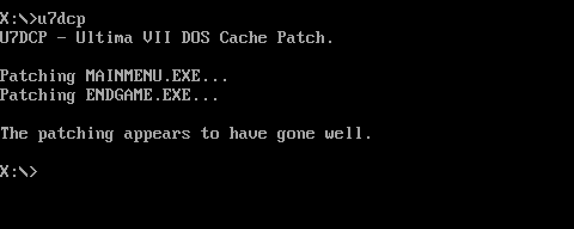

# Ultima VII DOS Cache Patch (u7dcp)
The Ultima VII DOS Cache Patch patches a bug in the original version of Ultima 7, where the game will force-enable the CPU's L1 cache on launch.

This can be an annoying bug if you'd like to run the game with L1 cache disabled as a means of slowing down the CPU and thus the execution of the game, which will otherwise run too fast on CPUs newer than the 486.

With the patch, the game will run on newer CPUs no worries.

You'll find a pre-compiled binary of u7dcp for DOS on [Tarpeeksi Hyvae Soft's website](http://tarpeeksihyvaesoft.com/soft/), along with further instructions on usage.

### Assembling
To assemble u7dcp for its native target, DOS, using the fasm assembler, do:
```
fasm src/main.asm u7dcp.exe
```

### What the patch does
Ultima 7 uses the [unreal memory addressing mode](https://en.wikipedia.org/wiki/Unreal_mode). Unfortunately, it seems that a side-effect of the game's way of entering this mode is the resetting of certain unrelated CPU flags, among them the one that controls whether L1 cache is enabled.

The patch modifies the parts of the game code that are used enter unreal mode, such that irrelevant CPU flags are no longer reset in the process.

You can find further details in the comments to the source file [src/main.asm](src/main.asm).


